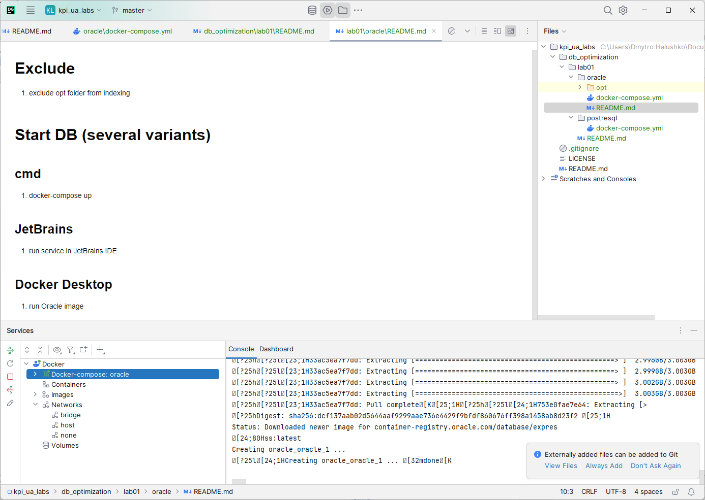
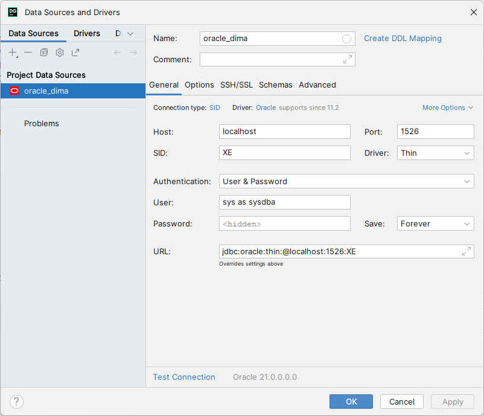

https://container-registry.oracle.com/ords/f?p=113:4:114815986201278:::4:P4_REPOSITORY,AI_REPOSITORY,AI_REPOSITORY_NAME,P4_REPOSITORY_NAME,P4_EULA_ID,P4_BUSINESS_AREA_ID:803,803,Oracle%20Database%20Express%20Edition,Oracle%20Database%20Express%20Edition,1,0&cs=3zEgn5KWi4DOadWG8bVCb33fQWsJL0tpO48bzHoE2QbwI0j9YOmOWQnEH2un94X1wqCubvobG5GKs-jTlDKXQUw


# Exclude 
1. exclude opt folder from indexing

# Start DB (several variants)
## cmd
1. docker-compose up
2. 
## JetBrains
1. run service in JetBrains IDE
## Docker Desktop
1. run Oracle image 

# Connect



#  Завдання
1. Підключитися до БД
2. Виконати EMPLOYEES.sql
3. Виконати CITIES.sql
4. Виконати insert_values_into_cities.sql
5. Виконати generate_random_phone_number.sql
6. Виконати insert_values_into_cities.sql
7. Виконати запит 
```
begin
    INSERT_VALUES_INTO_CITIES();
    INSERT_VALUES_INTO_EMPLOYEES();
end;
```
8. Виконати запит
```
begin
    UPDATE_MANAGERS(100000, 8);
end;
```
9. Виконати запит для представлення ієрархії
```
SELECT LPAD(' ', (LEVEL-1) * 2) || FIRST_NAME || ' ' || LAST_NAME AS EMPLOYEE_NAME, level
from EMPLOYEES
start with id = 1
connect by nocycle PRIOR id = MANAGER_ID;
```
10. Кожну дію Ви маєте розуміти і пояснити